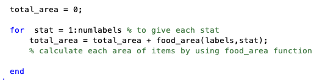

## Project Report

#### NAMES:

* Boipelo Hlatshwayo 

* M. Bahadir Kucuk

* * Necmettin Calibasi

** 15th December, 2019 **

Table of Contents

* Introduction 

* Literature Study        
* Concept of Operations        
* Product Mission Statement        
  * System Block Diagram        
  * User Scenarios        
  * Use Case Diagram        

* System Requirements        

  * Functional Requirements        
  * Non-Functional        
  * Privacy/Safety concerns        
  * Constraints        [8](#h.sc02592okb0h)

* System Design        9

  * Components        

  * Type of Processing        

* Classification        

* Testing        

  * Performance Classifier        [
  * Performance Algorithm        

*[Project Demo](#h.wxgoiwxi5suy)        [12](#h.wxgoiwxi5suy)

*[Evaluation](#h.lmfkqg8tlvut)        [13](#h.lmfkqg8tlvut)

*[Reflection](#h.may5qq2qvle3)        [13](#h.may5qq2qvle3)

*[Risk Analysis](#h.51i4s35l62sp)        [14](#h.51i4s35l62sp)

*[Schedule](#h.cc5p7zg2cd7o)        [14](#h.cc5p7zg2cd7o)

*[Task Division](#h.23r98aogzokj)        [15](#h.23r98aogzokj)

*[Appendix](#h.7zqfprkfwjtv)        [15](#h.7zqfprkfwjtv)

*[Image Processing](#h.sghaa2q67adl)        [15](#h.sghaa2q67adl)

[Ultrasonic Sensor](#h.nqsjebc2kqp8)        [21](#h.nqsjebc2kqp8)

[EV3 Motor](#h.nqsjebc2kqp8)        [21](#h.nqsjebc2kqp8)

[All System Code](#h.nqsjebc2kqp8)        [22](#h.nqsjebc2kqp8)

[Resources](#h.5o53q8s4pdj2)        [27](#h.5o53q8s4pdj2)

# Introduction

The purpose of this project is to design a domestic animal feeder that gives food by learning the eating patterns of the domesticated animal on a regular basis and to automate the process of feeding domesticated animals to reduce food wastage and eliminate stale food by using classification and a Machine Learning derivative algorithm. The problem can be broken down into three components:

For the problem of stale food,  many domesticated animal foods are kept in sealed containers to avoid the escape of moisture resulting in stale food. To tackle this problem we have a sealed container which is part of the automatic dispensing unit. The goal is to dispense food according to the data obtained from the eating behaviour of the domesticated animal. The device makes calculations to give a precise amount of food that the animal needs based on previous data taken from the feeding bowl of the animal.

For the reduction in food wastage, at this point we have solved the issue of stale food but, the distributed amount of the food also has to be optimized to reduce wastage. We will implement a Machine Learning derivative algorithm to learn the eating patterns and portion sizes required by the domesticated animal in using an algorithm which will be able to determine when and how much food needs to be dispensed optimally to ensure an empty bowl. With the help of preventing stale food, the project aims to prevent food wastage.

For the tailored automated feeding schedule, based on the machine learning derivative, the algorithm learns the eating patterns of the domesticated animal and distributes food accordingly within 2 hour intervals throughout the day. This allows the animal to be fed on a regular basis whilst not providing more or less than the required amount for the day. This will allow for example, the owner of the animal to leave home for a few days while maintaining a consistent feeding schedule.

# Literature Study

In doing a simple search of an automated pet feeding unit we found that there are a variety of products on the market. In this research we found that there are many options to what we are trying to achieve, but the implementation is far different and more of a “manual” nature compared to our approach. Many of these high tech devices on the market approach the problem with a user having to pre-program the feeding schedule for their domesticated animal on the distribution unit. The most advanced unit we have encountered has a mobile application that can control the unit remotely with built-in functionality to the degree of remotely distributing food, accessing a built-in camera to see if the domestic animal is in need of more food and other additional gimmicky features that are not of real value.

The main differences between what we are seeing currently available on the market and what we are seeking to develop is that user input from the owner is always needed and that the unit in terms of its distribution capabilities is not dynamic. The question now is, is it worth it to create a dynamic feeding solution for this application? As with everything else we have on Earth, our resources are limited. The undertaking of optimizing all aspects of life where non-renewable resources are required will be strictly beneficial for the environment in the general case. Any wastage of any resources shouldn’t be justified whether the resource is renewable or not.

How has the competition gone about implementing their solution to this problem? In analyzing the description of many automated pet feeders the approach is to pre-program some characteristics of a feeding schedule such as distributing every 4 hours, number of meals per day and to prolong the feeding in a single sitting, meaning the distribution will be slow to stop the domesticated animal from eating too much too quickly.  

# Concept of Operations

## Product Mission Statement

The mission of this project is to prevent food wastage by preventing stale food and to help people on feeding their domestic animals regularly. The possible stakeholders of this project is everyone that has a domestic animal. How project improve the quality of life can be seen with examples in user scenarios part.

## System Block Diagram

This block diagram shows the interactions between parts of the device. Sensors are directly connected to the motor. If it detects an object in front of the bowl, it makes the motor tick. And the motor takes the food from storage and fills the bowl out. If the food in the storage is below the determined level, the device sends a notification to the user by means of app.

## User Scenarios

Miriam, 29, is a stewardess in the KLM Royal Dutch Airlines. She travels a lot. Her cat, Smokey, always waits for Miriam to be able to get some food. But sometimes he suffers from hunger because of Miriam’s forgetfulness. Miriam has been looking for a machine to feed her cat for a long time when she is not at home. Also, she wants to get notifications by an application about Smokey’s food schedule. Finally, Miriam finds and buys this device. First thing she needs to do is to download the app to use the device because she has to be in contact with the device when she is not available to check her cat. Then as a first step she needs to fulfill the storage of device and give enough food to the machine as a maximum amount of food that Smokey can eat in one go. Device takes this amount into consideration and never exceed this level.

After three days, Miriam receives a notification by her phone. It says that the storage is almost empty and it needs to be fulfilled. Miriam buys a new package of cat food on her way and come back to home. Now she feels relaxed because she doesn’t have to bear her cat’s food amount in mind anymore. She can works relievedly.

Niyaz is a bachelor student in the Netherlands. He spends most of his time in non-profit organizations. Especially he cares about the food wastage in the world. But he has a problem in his own home. Niyaz’s cat, Sems, has an eating disorder. Whenever Niyaz gives food to his cat, Sems always eats nearly half of it and leaves the rest of it in the bowl  and two hours later he comes back and wants fresh food. Because cats don’t like to eat stale food. Thus a lot of remaining food run to waste and Niyaz is so upset. To find a solution to this problem Niyaz starts to use this device in his home. The device works on a regular basis and arranges the amount of food according to cat’s eating habits. So Niyaz can contribute to preventing food wastage for the environment.

## Use Case Diagram

# System Requirements

## Functional Requirements

The system should:

*   Recognize if a domesticated animal is at the bowl.
*   Distribute food.
*   Dynamically calculate the amount of food required based on eating patterns of the domesticated animal.
*   Collect the data of eating patterns which will be used for future calculations regarding the amount of food.
*   Calculate the area of food using image processing. A before and after picture will be taken to calculate if there is an error term.
*   Segment the time before running the next iteration. Ex. 2 hour intervals.

## Non-Functional

Usability of the system are listed as:

*   Distribute the animal food as efficiently as possible without human interaction.
*   Overtime the estimations should be more accurate.

Reliability of the system are listed as:

*   The system improves output results over time by reducing the error term.
*   We save previous outputs that will be used in the next iteration of the function. This is the only data that is stored for the system to work.
*   Redundancy: User notifications. Ex. Low food indicator and software optimizations (for domesticated animal).
*   The system has a single moving part. The motor will be used for low intensity movements.

Performance of the system are listed as:

*   Not an important aspect considering the architecture and intended use of the system.
*   Basic operations such as addition, subtraction, division and multiplication are used for the processing of data.
*   The pre-processing (image processing) is the most intensive operation in acquiring the numbers we need for the basic operations. This step in hypothetical terms has 2 hours to perform this task before the next iteration.

Supportability of the system are listed as:

*   Very low human interaction is needed with the system. Documentation is provided for the owner.
*   Cost effective: reduces food wastage and saves money in the long term.

## Privacy/Safety concerns

The privacy and safety issues are listed below:

*   The motor could jam and cause it to overheat.
*   The overheating could potentially cause a fire.
*   That fire can spread in the environment surrounding the embedded system.
*   No privacy concerns. The system does not have any networking capabilities.
*   Even if stolen the only data stored is an average value.
*   The camera is always pointing down.
*   When the food storage is full the unit is top heavy which could allow it to potentially fall on the domesticated animal if it is destabilized. There are engineering techniques that can be used to reduce this risk in manufacturing.

## Constraints

The constraints are listed below:

*   Pure ML algorithm needs a dedicated more expensive processor.
*   Implemented a ML derivative algorithm. I.e. explicit input values.
*   The system can be further optimized by using ML to take more variables as input and then use gradient descent to calculate a more reliable reduced error term.

The MosCoW model: The requirements are defined as a functional and non-functional. All of them must have in the system except the stand( a structure to implement other components) and ML algorithm. By lack of time and resources, these features are not implemented. Finally,  So from a MoSCoW point of view our project is quite successful because it runs the core idea of the project.  

Unified Modeling Language: The UML is shown in the use case diagram above.

# System Design

## Components

The entire project is not too complex. At this stage the identified resources are:

*   Matlab
*   Camera
*   Ultrasonic sensor
*   Motor
*   Microprocessor Chip
*   Bowl
*   Stand (to implement others)

The ultrasonic sensor and motor of  the LEGO MINDSTORMS Education EV3 robot is used in this project.

The project is based on MATLAB language.

Bowl and stand(structure to implement other components) is not used in the project.It is important to issue that this project is planned to finish within 3 weeks. Thus, all of the components is not used due to time and resources issues. For example we need a 3D printer to have a structure to implement our camera, microprocessor, motor and sensor. Instead of being fastened to a lack of resources for 3 weeks, we try to manage to run the system in the light of the core idea of the project.

## Classification

Image Processing is used for Connected Components Labeling Algorithm. Firstly, Binary Imageis obtained from the image by the method of Thresholding. Then, we used Morphological Methodsto eliminate small white holes in the image by the method of Erosion. Finally, the items in the image is numbered with the help of the method of Labelling.

After image processing, the area of labelled items in the images is calculated with the help of the matlab built in function "regionprops". Having the area of foods in the image, the running time for the motor that gives food is calculated. The steps for each process and all system pseudo code and code can be reached in the appendix.

*   # Testing

The system is tested many times. By doing that, the parts that do not work correctly are changed related to the code. Related to the image process testing, you can see the confusion matrix below, which shows in which cases the image process does not calculate food area correctly.

*   ## Performance Classifier

Confusion Matrix

<table class="c83">

<tbody>

<tr class="c31">

<td class="c64" colspan="2" rowspan="1">

</td>

<td class="c108" colspan="2" rowspan="1">

ACTUAL VALUES

</td>

</tr>

<tr class="c14">

<td class="c81" colspan="1" rowspan="3">

PREDICTED

</td>

<td class="c41" colspan="1" rowspan="1">

</td>

<td class="c65" colspan="1" rowspan="1">

True

</td>

<td class="c66" colspan="1" rowspan="1">

False

</td>

</tr>

<tr class="c76">

<td class="c4" colspan="1" rowspan="1">

True

</td>

<td class="c65" colspan="1" rowspan="1">

If foods are scattered separately in the bowl

</td>

<td class="c66" colspan="1" rowspan="1">

No food in the bowl

</td>

</tr>

<tr class="c76">

<td class="c4" colspan="1" rowspan="1">

False

</td>

<td class="c65" colspan="1" rowspan="1">

There is food in the bowl

</td>

<td class="c66" colspan="1" rowspan="1">

If foods are cumulative

</td>

</tr>

</tbody>

</table>

The main issue in the performance of the classifier is based on how foods are scattered in the bowl before taking an image of it. If the foods are separately scattered, then image processing works well based on the testing result. The accuracy rate cannot be determined because of the complex system.

The testing videos can be reached by this link[[1]](#ftnt1).

## Performance Algorithm

# Project Demo

The demo of the project can be reached by this link[[2]](#ftnt2).

*   # Evaluation

*   ## Reflection

The team worked very well together and on some occasions we did bump heads when we encountered logical difficulties regarding the problems we needed to solve. We were efficient in resolving such matters by presenting all our solutions to the group and using the one we thought would yield the best outcome. In short, we realized that solving problems is difficult, especially when there are various ways of solving the same problem. Communication at times was at a deficit regarding our backgrounds but our success reinforced team morale after each challenge we faced.

As a team we would say we are satisfied by the input and performance of each of our members. Every member would always contribute positively towards the work we needed to complete. We did experience many delays throughout the development phase of our project due to instability of software, mainly MATLAB. Our schedule allowed us to have enough overhead should we fall behind on a specific goal in terms of time. Fortunately, we maximized our time during these errors by letting one group member resolve the technical issues while the other group members worked on the logical flow of the project. All in all the development phase took much longer than we anticipated. We overcame this by working outside of the mandatory labs to make sure everything was working on time. The one big decision we made which could be seen as a risk was choosing to stay with MATLAB rather than using a more stable technology like Python. It was very evident that we would need to read a lot of documentation in order to achieve the same thing in MATLAB.

Lastly, the implementation choice would have been far more different had classification not been a requirement. As we said before there are many ways to solve the same problem but as a group we all agree that using more tangible output such as the weight of the food distribution rather than the area would yield a significantly lower error term with regards to the distribution of food. We think this is the one thing we would have done differently.

## Risk Analysis

For the risk analysis we defined the risks and give the possible solutions to them;

*   Absence of group members: If one of the group members doesn’t attend the lab then workload is equally divided between members and things to do are finished separately.
*   Delaying the project: If things don’t go well and the project has to be delayed; let Teaching Assistant (TA) know and essential parts of the project are done and it is proposed to the TA.
*   Deficiency of tools: If the tools provided are not reliable enough to complete the project. Example: structure,motor. Then, we will assume that we have things which we lack and continue to run the core idea of the project.  
*   Management of time: If some parts of the project aren’t done on time, there will be extra meetings to complete these parts.

## Schedule

## Task Division

As a group we would agree that the undertaking of work was split evenly amongst all of us. We are not including a list of what each group member did because we cross pollinated our tasks according to who was knowledgeable at the time and was able to solve something effectively and efficiently. As a group we are happy with our efforts and have no complaints. In the event we felt that a group was not doing anything we would have then listed what each group member has done but luckily that was not the case with this project.

# Appendix

Pseudo Code

******************************Motor Control*********************************

Function motorRun = control(calculated_time)

Assign a class as mymotor

Set mymotor speed to 5

Start mymotor

Wait calculated_time seconds

Stop mymotor

Set mymotor speed to -5

Start mymotor

Wait calculated_time seconds

Stop mymotor

 End

*****************************Calculation Time******************************

Function calculation_time = specTime(imageArea)

Take the mean value of average list

Subtract imageArea from average value and assign it area_to_give

 

If area_to_give < 0

Assign area_to_give to zero

End

Initialize coefficient to 0.4 as a constant

Multiply area_to_give with coefficient    

End 

*************************** Image Processing**********************************

 

Function total_area = food_image_processing()      

Generate the number of items and display them

Initialize total_area to zero

For each item in the image

Add each item’s area to total_area by using food_area function

End

End

 

*******************************  Food Area  **************************************

Function food_area = give_area(first argument, second argument)

Calculate each item’s area by using the formula

End

**************************** Ultrasonic Sensor **********************************

Function distance = sonicReading()

            While

Create an object as mysonicsensor

                        Measure the distance

            End

End

*************************** All System Pseudocode ****************************

Function give_food = AntiStaleAnimalFeeder()

Initialize maximum amount of food to amount taken from image process

Add maximum food to average_list

Initialize food_given to 0

            While

                        Initialize the storage to 13 times of maximum food_given

                        Initialize storage_remain to the result of subtraction of food_given from storage

                        If storage_remain < 2

                                    Send notification to the user

                                    Break

                        End

                        Initialize average to mean value of average_list

                        Assign left_food to the return of food_image_processing(image of the bowl)

                        If left_food == 0

                                    If average + 1 <max_food

                                                Increment average value

                                    Else

                                                Display warning

                                    End

                        Else

                                    Initialize delta to the result of subtraction of left_food from average

                                 Add delta to average_list

                     End

                     Initialize runtime_motor to the return of specTime(left_food)

                       

Create an object as mysonicsensor and start reading the distance

                                    While

                                                If distance < 30

                                                            Give food using control(runtime_motor)

                                                            Break

                                                End

                                    End

End

## Image Processing

The first thing to take a shot and convert the image to the binary image. Having that, we can able to make a classification between the foods and the background. The number of food items is 10\. While calculating the area we call it as "stat".

The code snippet above is to sum the area of each stats.

In each step the total area is shown for the control whether it calculates each area.This is just for now to see what happens.

After seeing that the code works well and sums each stat (in this photo the number of stats is 10),  the "disp" part is deleted from the code.

 

*************  Code for Image Processing to Calculate Area **************

function total_area = food_image_processing(path)

 

image = imread(path); % it reads the image by given path

imshow(image); % to see what we obtain from the bowl

imwrite (image,"objects.bmp","bmp"); % it changes the extension of the image

   

image_grey=rgb2gray(image); % we are interested in the area not colour.

level=graythresh(image_grey); % calculates the threshold by using the Otsu method

image_grey_threshold= im2bw(image_grey,level);

   

image2=imopen(image_grey_threshold,strel('disk',1)); % to eliminate small white holes

%on the objects

image3=imcomplement(image2); % reverse the black and white

[labels,numlabels]=bwlabel(image3); % to label our image to identify the objects

   

% FOR LOOPING to take total area for each different stat.

total_area = 0;

   

for  stat = 1 : numlabels % to give each stat

total_area = total_area + food_area(labels,stat);

% calculate each area of items by using food_area function

end

end

*************************** food_area function **********************************

function f = give_area(labels,wanted_stats)

stats = regionprops(labels, 'all'); % to query all the properties of all BLOBs

stats(wanted_stats); % to take the desired object

 

f = stats(wanted_stats).Area);

% the formula to calculate the area of the object

end

*********************************  end of code  ***********************************

## Ultrasonic Sensor

This is to see whether the ultrasonic sensor can see the obstacle from the distance less than 30 centimeters. As you can see above, the distance between the obstacle and the sensor is 4 centimeter.

This is to see whether the ultrasonic sensor can see the obstacle from a distance of 30 centimeters. As you can see above, the distance between the obstacle and the sensor is 30 centimeter.

This is to see whether the ultrasonic sensor can see the obstacle from a distance of more than 30 centimeters. As you can see above, the distance between the obstacle and the sensor is 54 centimeters.

*********************** basic code to read distance ***************************

function distance = sonicReading()

    myev3 = legoev3('USB'); % to open a new connection to a EV3 robot

   

 while 1

 mysonicsensor = sonicSensor(myev3); % to create an object

        distance = readDistance(mysonicsensor); % to read the samples and to store it  

 end

end

********************************** end of code **********************************

## EV3 Motor

The below code implements the opening and closing mechanism for the animal feed using the motor from the EV3 robot. This code opens and closes the mechanism based on a time value calculated in another function so we can dynamically control the amount of food distributed at a given time based on the behaviour of a domesticated animal.

************************************* code *************************************

function test = motorTest(calcTime)

myev3 = legoev3('USB');            % create EV3 object to connect to robot

mymotor = motor(myev3,'A');    % connecting to motor in port A

resetRotation(mymotor)

mymotor.Speed = 5; % speed for opening

start(mymotor);

pause(calcTime);                          % wait time for motor operation

stop(mymotor);

mymotor.Speed = -5;                  % speed for closing

start(mymotor);

pause(calcTime);                        % wait time for motor operation

stop(mymotor);

end

********************************** end of code **********************************

## 

*   # References

Cividjian, N. (2017). Pervasive computing: engineering smart systems. Amsterdam, The Netherlands: Springer.

* * *

[[1]](#ftnt_ref1) [http://bit.ly/2YO56DH](https://www.google.com/url?q=http://bit.ly/2YO56DH&sa=D&ust=1577109197918000) 

[[2]](#ftnt_ref2) [http://bit.ly/2YRUNOP](https://www.google.com/url?q=http://bit.ly/2YRUNOP&sa=D&ust=1577109197917000)

[[3]](#ftnt_ref3) [http://bit.ly/2RSyOG4](https://www.google.com/url?q=http://bit.ly/2RSyOG4&sa=D&ust=1577109197918000) 

